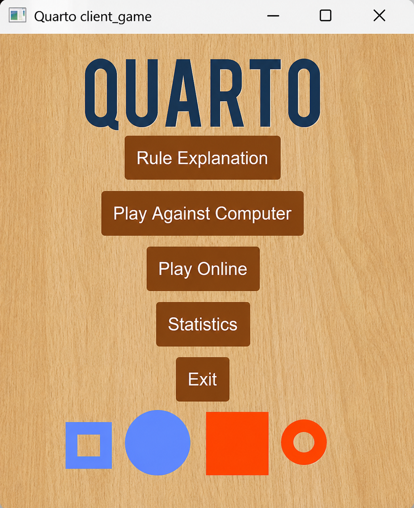
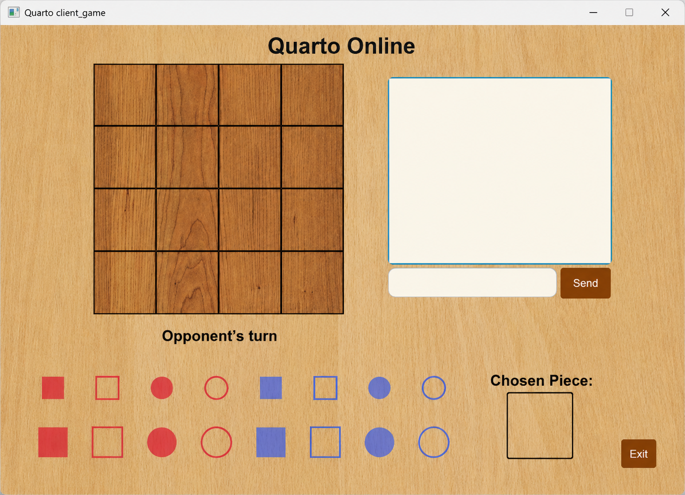

# ♟️ Quarto Concurrent Multiplayer Engine

A Java-based network engine for the board game Quarto, featuring a custom TCP-based client-server architecture and persistent statistical tracking via MySQL.

## 🏗️ Architecture Overview
This project is an asynchronous multi-client game engine. It utilizes a custom text-based protocol over raw TCP sockets to synchronize game state between clients. The system follows a decoupled architecture, separating the network transport layer, the graphical presentation layer (JavaFX), and the persistence layer (MySQL).
The system is architected for deterministic state synchronization, prioritizing thread safety and data integrity during dynamic player state transitions.

## 🎮 Game Interface
The engine provides a polished graphical interface for both local and network play.

| Main Menu | Online Matchmaking |
| :---: | :---: |
|  |  |

## ⚙️ Technical Specifications
*   **Networking:** Custom TCP protocol utilizing `java.net.Socket` and `BufferedReader`/`PrintWriter` for stream framing.
*   **Concurrency Model:** Asynchronous Thread-per-connection execution model for isolated client session management.
*   **Thread-Safe Matchmaking:** Implemented a fair `ReentrantLock(true)` to eliminate race conditions and guarantee strict FIFO ordering during player pairings.
*   **UI Layer:** JavaFX state-driven rendering, with strict decoupling between network events and the UI thread via `Platform.runLater()`.
*   **Persistence:** MySQL integration for player authentication and statistical tracking via a DAO-like pattern.

## 🛠️ Setup Instructions

### Prerequisites
- **JDK:** 17 or higher.
- **JavaFX SDK:** Configured in your IDE module path.
- **MySQL Server:** Running locally.

### Database Configuration
1. Create a MySQL database instance named `quarto_db`.
2. Run the provided schema script: `quarto_db.sql`.
3. Configure your database credentials (URL, User, Password) in `src/server/db/DBHelper.java`.

### Execution
1. Launch the server application: `TCPServer.java` (Required for online multiplayer).
2. Launch the client application: `Main.java` (Supports offline AI mode and online matchmaking).

## 🚀 Architectural Roadmap & Production Scalability
This engine successfully demonstrates real-time network state synchronization. To evolve this into a high-concurrency production system, the following architectural paths are identified:

*   **From Blocking I/O to Non-Blocking:** The current "Thread-per-connection" model limits scalability due to OS thread overhead. A migration to **Java NIO** or the **Netty framework** would enable an event-loop/reactor pattern, supporting thousands of concurrent connections on minimal hardware.
*   **Protocol Efficiency:** Transitioning from text-based newline-delimited strings to a binary serialization format (e.g., **Protocol Buffers**) would significantly reduce bandwidth consumption and improve parsing performance.
*   **Resilient State:** Currently, game state is transient (in-memory). Future iterations would require a distributed state cache (e.g., **Redis**) to enable seamless server restarts without terminating active game sessions.
