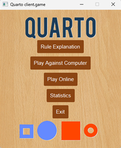
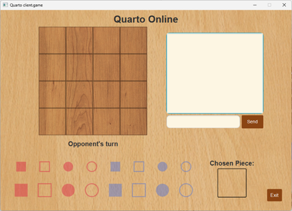

# ♟️ Quarto Client-Server

A Java client-server implementation of the Quarto board game featuring offline AI gameplay, online multiplayer over a custom TCP protocol, and persistent player statistics backed by MySQL.

## ✨ Key Features

- **Offline Mode:** Single-player gameplay against an intelligent AI opponent.
- **Online Multiplayer:** Custom text-based protocol over raw TCP sockets for real-time game state synchronization.
- **Robust Concurrency:** Multi-threaded server utilizing a thread-per-connection model.
- **Thread-Safe Matchmaking:** Implemented using fair `ReentrantLock(true)` to eliminate race conditions and guarantee strict FIFO ordering.
- **Modern UI:** JavaFX desktop graphical interface with clear separation of concerns (MVC-inspired).
- **Persistence:** MySQL authentication and statistical tracking via a DAO-like pattern.

## 🎮 Game Interface

The engine provides a polished graphical interface for both local and network play.

| Main Menu | Online Matchmaking |
| :---: | :---: |
|  |  |

## 🏗️ Architecture Overview

This project follows a layered client-server architecture separating presentation, networking, business logic, and persistence layers. The system is architected for deterministic state synchronization, prioritizing thread safety and data integrity during dynamic player state transitions.

```text
        +----------------+
        | JavaFX Client  |
        +-------+--------+
                |
         TCP Socket Protocol
                |
    +-----------+-----------+
    |   Matchmaking Server  |
    +-----------+-----------+
                |
          Game Sessions
                |
         +------+------+
         |    MySQL    |
         |  Database   |
         +-------------+
```
## ⚙️ Technical Specifications

### Technologies
- **Core:** Java, JavaFX, TCP Sockets
- **Concurrency:** Multithreading, ReentrantLock
- **Persistence:** MySQL, JDBC

### Implementation Details
- **Networking:** Custom TCP protocol utilizing `java.net.Socket` and `BufferedReader`/`PrintWriter` for stream framing.
- **Connection Model:** Thread-per-connection architecture using dedicated threads for isolated client sessions.
- **Synchronization:** Fair `ReentrantLock(true)` guaranteeing deterministic matchmaking and eliminating race conditions.
- **UI Layer:** MVC-inspired architecture with independent network layer and thread-safe UI updates via `Platform.runLater()`.
- **Persistence:** MySQL integration for player authentication and statistical tracking via a DAO-like pattern.

## 🛠️ Setup Instructions

### Prerequisites
- **JDK:** 17 or higher.
- **JavaFX SDK:** Configured in your IDE module path.
- **MySQL Server:** Running locally.

### Database Configuration
1. Create a MySQL database instance named `quarto_db`.
2. Run the provided schema script: `quarto_db.sql`.
3. Configure your database credentials (URL, User, Password) in `src/server/db/DBHelper.java`.

### Execution
1. Launch the server application: `TCPServer.java` (Required for online multiplayer).
2. Launch the client application: `Main.java` (Supports offline AI mode and online matchmaking).
